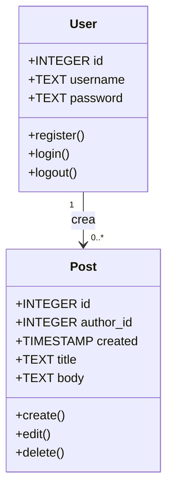

# Diagrama de classes UML

```mermaid
classDiagram
    class User {
        +INTEGER id
        +TEXT username
        +TEXT password
        +register()
        +login()
        +logout()
    }

    class Post {
        +INTEGER id
        +INTEGER author_id
        +TIMESTAMP created
        +TEXT title
        +TEXT body
        +create()
        +edit()
        +delete()
    }

    User "1" --> "0..*" Post : crea
```
