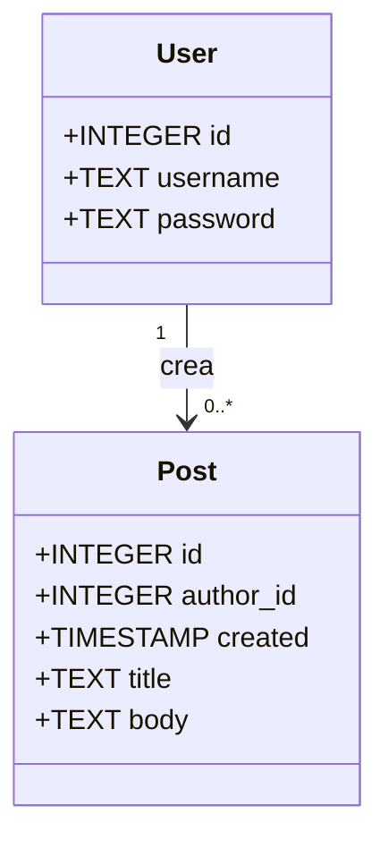

# Diagrama de classes UML

Aquest fitxer documenta les classes User i Post i la relació entre elles.

```mermaid
classDiagram
    class User {
        +INTEGER id
        +TEXT username
        +TEXT password
    }

    class Post {
        +INTEGER id
        +INTEGER author_id
        +TIMESTAMP created
        +TEXT title
        +TEXT body
    }

    User "1" --> "0..*" Post : crea
```
